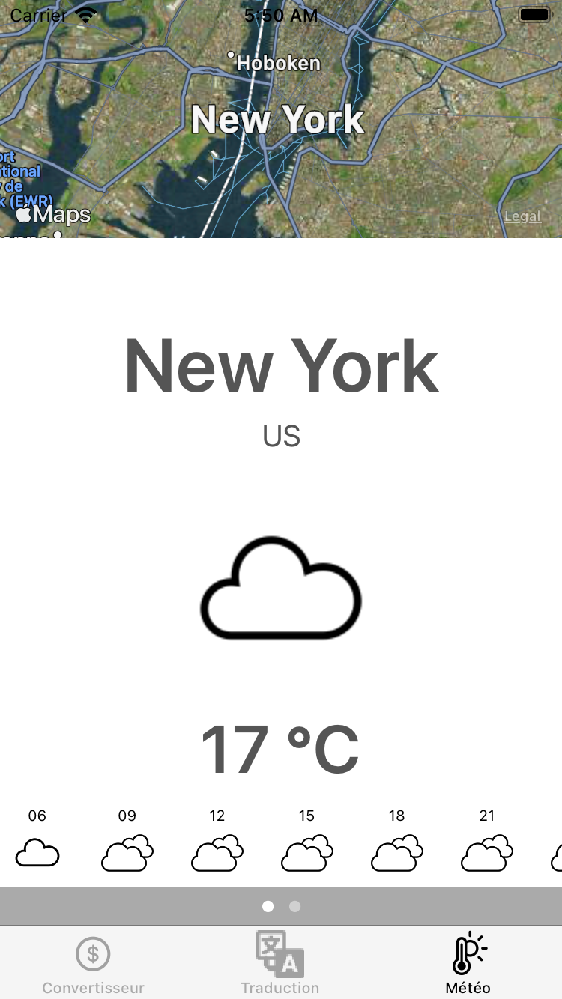

<h1 align="center">Hi 👋, I'm Pierrick</h1>
<h3 align="center">Baby developpeur iOS en reconversion professionnelle pour mettre moins de sel dans mon avenir</h3>

- 🔭 Je travaille sur **le projet 10 - OC**

- J'apprend le Swift **via OPENCLASSROOMS, UDEMY**
- Vous trouverez mes projets dans mon **GITHUB**
- 
## Balluchon

Une application de voyage devellopée pour le projet 9 d'OpenClassrooms
  -une page convertiseur de monnaie
  - une page traduction
  - une page meteo

No storyboard, appel API
<h3 align="center"></h3>

## Calculatrice

Une calculatrice dévellopée pour le projet 5 d'OPENCLASSROOMS
  - 4 opérateurs principaux
  - gestion des nombres positifs et négatifs
  - architecture MVC
  - 2 versions
    - Storyboard
    - No Storyboard
  - limitations
    - nombre tapé par l’utilisateur: max 10 chiffres
    - resultat max : 1.79e+308
    - expression Max : 24 characteres
<h3 align="center"></h3>

## OC_PIZZA
Projet OpenClassrooms
projet d'amélioration d'un système de gestion des commandes, de leur réception à leur livraison en passant par leur préparation ;

Le projet comprend :

- Un dossier de conception fonctionnelle : à l’attention de la maîtrise d’ouvrage (MOA) et de la maîtrise d’œuvre (MOE)
- Un dossier de conception technique : à l’attention des développeurs, mainteneurs et de l’équipe technique du client
- Un dossier d’exploitation : à l’attention de l’équipe technique du client
- Le procès-verbal de livraison finale

<h3 align="center">
</h3>

<h3 align="left">Languages and Tools:</h3>

        

