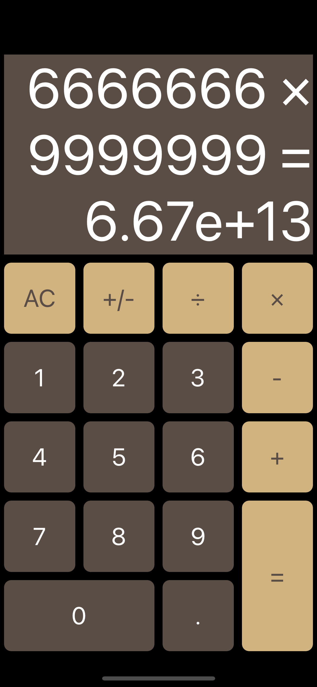
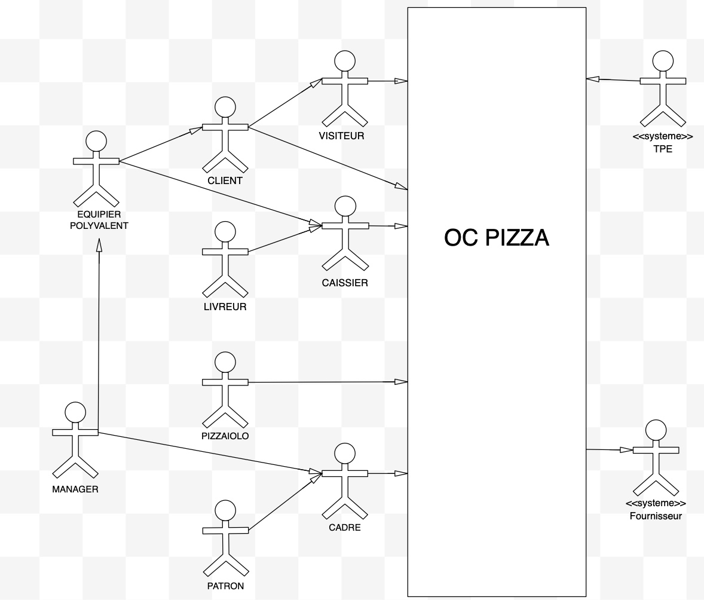

<h1 align="center">Hi 👋, I'm Pierrick</h1>
<h3 align="center">Baby developpeur iOS en reconversion professionnelle pour mettre moins de sel dans mon avenir</h3>

- 🔭 Je travaille sur [Projet 6 - OC](git@github.com:Jcaero/OC_PIZZA.git)

- J'apprend le Swift **via OPENCLASSROOMS, UDEMY**
- Vous trouverez mes projets dans mon **GITHUB**

## Calculatrice

Une calculatrice dévellopée pour le projet 5 d'OPENCLASSROOMS
  - 4 opérateurs principaux
  - gestion des nombres positifs et négatifs
  - architecture MVC
  - 2 versions
    - Storyboard
    - code
  - limitations
    - nombre tapé par l’utilisateur: max 10 chiffres
    - resultat max : 1.79e+308
    - expression Max : 24 characteres
<h3 align="center"></h3>

## OC_PIZZA
Projet 6 OpenClassrooms

Analysez les besoins de votre client pour son groupe de pizzerias

via
des persona pour les différents acteurs interagissant avec le futur système
un diagramme de cas pour la liste des fonctionnalités
des users story A4 pour le descriptif des fonctionnalités
un diagramme de flux pou le cycle de vie des commandes

<h3 align="center">
</h3>

<h3 align="left">Languages and Tools:</h3>

        

